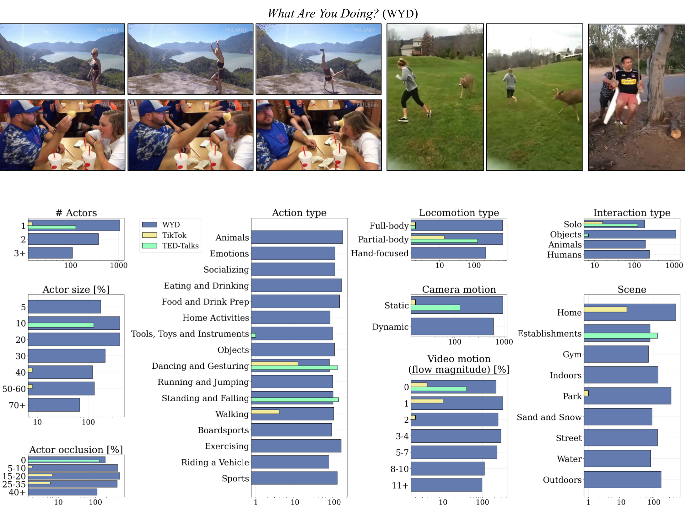

# The ‘What Are You Doing?’ (WYD) benchmark

TL;DR: ‘What Are You Doing?’ (WYD) is a new benchmark for fine-grained
evaluation of controllable image-to-video generation of humans,
as described in the paper:
>Emanuele Bugliarello, Anurag Arnab, Roni Paiss, Pieter-Jan Kindermans,
>Cordelia Schmid. (2025).
>What Are You Doing? A Closer Look at Controllable Human Video Generation.

WYD consists of 1,544 captioned videos that have been meticulously collected and
annotated with 56 fine-grained categories. These allow us to systematically
measure performance across 9 aspects of human generation, including actions,
interactions and motion. We also propose and validate automatic metrics that
leverage our annotations and better capture human evaluations.



## Overview

This repository includes:

- Dataset annotations in [`wyd.json`](wyd.json), detailed in [DATASET.md](DATASET.md).
- Human-verified video segmentation masks for each actor in a video (<font color="red">to be released</font>).
- Code to reproduce our evaluation metrics (<font color="red">to be released</font>).

## Citing this work

Add citation details here, usually a pastable BibTeX snippet:

```
@article{bugliarello-etal-2025-wyd,
      title={What Are You Doing? A Closer Look at Controllable Human Video Generation},
      author={Bugliarello, Emanuele and Arnab, Anurag and Paiss, Roni and Kindermans, Pieter-Jan and Schmid, Cordelia},
      year={2025},
}
```

## License and disclaimer

Copyright 2025 Google LLC

All software is licensed under the Apache License, Version 2.0 (Apache 2.0); you
may not use this file except in compliance with the Apache 2.0 license. You may
obtain a copy of the Apache 2.0 license at:
https://www.apache.org/licenses/LICENSE-2.0

All other materials are licensed under the Creative Commons Attribution 4.0
International License (CC-BY). You may obtain a copy of the CC-BY license at:
https://creativecommons.org/licenses/by/4.0/legalcode

Unless required by applicable law or agreed to in writing, all software and
materials distributed here under the Apache 2.0 or CC-BY licenses are
distributed on an "AS IS" BASIS, WITHOUT WARRANTIES OR CONDITIONS OF ANY KIND,
either express or implied. See the licenses for the specific language governing
permissions and limitations under those licenses.

This is not an official Google product.
